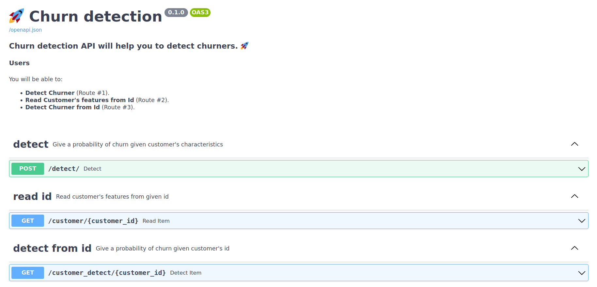

# Chaos

<p align="center">
    
</p>

> **The current project aims to deploy a churn detection machine learning model** into **production environment**, using some **cloud technologies** such as **Docker** and **Kubernetes**.
>
> **Original code base for churn detection model is here** :
>
> [🐟🐠🐟🐠🐟🐠🐟🐠](https://gitlab.com/yotta-academy/mle-bootcamp/projects/ml-project/project-1-fall-2022/churn-modelling-salima-charles-emeric)


## Getting started

### Install

```
poetry config --local virtualenvs.in-project true
poetry install
```

### Run API locally

```
source .venv/bin/activate
make run-server
```
### Try the API at adress :  
- http://0.0.0.0:8000/docs



## Docker image 
If you want to containerize locally your code and run it you can do the following :

### build and run:
Make sure your **GOOGLE_APPLICATION_CREDENTIALS** is set before runing image.
```
export GOOGLE_APPLICATION_CREDENTIALS=<path to json of the service account private key>
export SSH_PRIVATE_KEY=<path_to_shh_key> # Gitlab ssh key needed to import churn repo
make containerize-and-start-app
```
This command will build an image of your application, the tag of the image will be the short git sha1. It will create a local postgres sql bdd and the app will request on it. **Don't forget to add the csv data if this is the first time**

### run all tests:
The following command will enable you to build all the required environment to run unit tests, and functional tests.
Functional tests are very important because they enable you to try your application working on real elements. (Real bdd, real model etc)
In order to preserve production bdd performance, we build a local database (Postgres SQL) with docker. So don't forget to add the csv data!!. 
```
export GOOGLE_APPLICATION_CREDENTIALS=<path to json of the service account private key>
export SSH_PRIVATE_KEY=<path_to_shh_key> # Gitlab ssh key needed to import churn repo
make containerize-and-run-tests
```
### Build :
If you just want to build your app into an image :
```
export GOOGLE_APPLICATION_CREDENTIALS=<path to json of the service account private key>
export SSH_PRIVATE_KEY=<path_to_shh_key> # Gitlab ssh key needed to import churn repo
make build-docker-image
```

### Push your image in google container registry:
If you want to push your generated image directly to Google Container Registry without working with CI-CD, this is possible. 
Simply do :
```
export SHORT_SHA=$(git rev-parse --short=8 HEAD)
docker push eu.gcr.io/coyotta-2022/chaos-1:$SHORT_SHA
```


## Kubernetes

### create secret

```
kubectl create secret generic chaos-secrets-1 --from-file=key.json=<path to json of the service account private key> --from-file=<path to the config.yml>
```

## CI/CD

### Gitlab variables
	
- BASE64_GOOGLE_CREDENTIALS: (unused) base64 service account
- CONFIG_YML: yaml file with many config variables for Gitlab environment 
- GCP_SA_KEY: GCP service account private key (used to access gcp registry 
	and kubernetes)
- SSH_CHURN_ACCESS: private ssh key for churn model gitlab repo

## PROXY

help to connect to proxy

[proxy commands](proxy/proxy_SQL_connexion.md)


## GCLOUD :
help to work with gcloud.
### Identify gcloud  storage locally :
```
gcloud auth application-default login
```

🚩 **Do not forget to update your configuration files** 🚩

`config.yml` in sub folder `infrastructure/config`

```
gcs:
  bucket: "chaos-1"
  blob: "model/ChurnModelFinal.pkl"
```

## BDD
### How to work with psql commands. 
**psql commands are quite specifics** : 
#### Get help.
- `\?`
#### List databases.
- `\l`
#### List tables.
- `\dp`

### Local installation :
In order to not affect production data, in local environments we will work with a postgres container emulating bdd. 
We need to build and launch the containers, and to add data to it.
#### Launch Docker compose.
First launch the following  docker compose build command:
- `DOCKER_BUILDKIT=1 docker compose build --ssh churn_ssh=**your/path/to/ssh_churn_key**`
Then start the containers using. 
- `docker compose up` 
You will have 2 containers running, the churn api, and a postgres db on port 5442. 
If you are working with it for the first time, you need to upload datasets 1_-_customers.csv, and  1_-_indicators.csv into the bdd.
#### Connect to postgres.
First : Open a terminal, and connect to the postgres sql bdd using :
- `psql -h 127.0.0.1 -p 5442 -U postgres`
(Default password will be postgres). The prompt will display `postgres=# `
Then create a db called `churnapi`
Press enter 5 times
Then create db :
- `CREATE DATABASE churnapi;`

#### Connect to churnapi database:

- `\c churnapi`

#### Create a table name customer.
```
CREATE TABLE customer (
  ID_CLIENT SERIAL,
  DATE_ENTREE DATE,
  NOM VARCHAR(70),
  PAYS VARCHAR(50),
  SEXE VARCHAR(10),
  AGE SERIAL,
  MEMBRE_ACTIF VARCHAR(10),
  PRIMARY KEY (ID_CLIENT)
);
```
#### Append data from csv.

```
\COPY customer(ID_CLIENT, DATE_ENTREE, NOM, PAYS, SEXE, AGE, MEMBRE_ACTIF) FROM '**your/path/to/1_-_customers.csv**' DELIMITER ';' CSV HEADER;
```

#### Check your data.
```
SELECT * FROM customer;
```
#### Create a table named indicators :
```
CREATE TABLE indicators (
  ID_CLIENT SERIAL,
  BALANCE FLOAT,
  NB_PRODUITS INT,
  CARTE_CREDIT VARCHAR(10),
  SALAIRE FLOAT,
  SCORE_CREDIT FLOAT,
  CHURN VARCHAR(10),
  PRIMARY KEY (ID_CLIENT)
);
```

#### Append data from csv.

```
\COPY indicators(ID_CLIENT, BALANCE, NB_PRODUITS, CARTE_CREDIT, SALAIRE, SCORE_CREDIT, CHURN) FROM '**your/path/to/1_-_indicators.csv**' DELIMITER ';' CSV HEADER;
```

#### Check your data.
```
SELECT * FROM indicators;
```