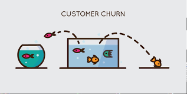
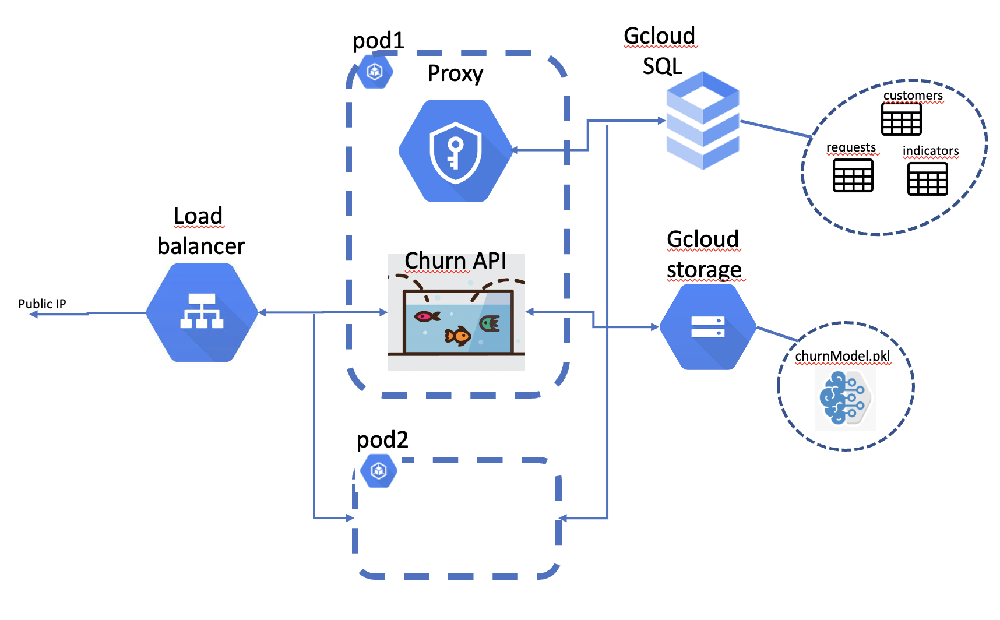

# Chaos

<p align="center">
    
</p>

> **The current project aims to deploy a churn detection machine learning model** into **production environment**, using some **cloud technologies** such as **Docker** and **Kubernetes**.
>
> **Original code base for churn detection model is here** :
>
> https://gitlab.com/yotta-academy/mle-bootcamp/projects/ml-project/project-1-fall-2022/churn-modelling-salima-charles-emeric

### *Check our project's technical documentation at*
 > http://34.140.247.33:8000/sphinx/

<!-- markdown-toc start - Don't edit this section. Run M-x markdown-toc-refresh-toc -->
**Table of Contents**

- [Chaos](#chaos)
    - [Getting started](#getting-started)
        - [Install](#install)
        - [Run API locally](#run-api-locally)
            - [Setup the configuration](#setup-the-configuration)
            - [Launch the server](#launch-the-server)
    - [Docker](#docker)
        - [build and run](#build-and-run)
        - [run all tests](#run-all-tests)
        - [Build the app](#build-the-app)
        - [Push your image in google container registry](#push-your-image-in-google-container-registry)
    - [Deployment on Google Kubernetes Engine](#deployment-on-google-kubernetes-engine)
        - [Deployment overview](#deployment-overview)
        - [Kubernetes secrets](#kubernetes-secrets)
    - [Testing](#testing)
        - [Unit tests and coverage](#unit-tests-and-coverage)
        - [Model performance](#model-performance)
        - [Functionnal tests](#functionnal-tests)
    - [CI/CD](#cicd)
        - [Workflow](#workflow)
            - [Integration steps view](#integration-steps-view)
            - [Job view](#job-view)
        - [Gitlab variables](#gitlab-variables)
    - [Local postgres db (test purpose)](#local-postgres-db-test-purpose)
        - [Run postgres db](#run-postgres-db)
        - [Insert test datas into postgres db](#insert-test-datas-into-postgres-db)
        - [Useful psql commands](#useful-psql-commands)
    - [API config files](#api-config-files)
        - [Access to Gcloud SQL](#access-to-gcloud-sql)
        - [docker-compose use case](#docker-compose-use-case)

<!-- markdown-toc end -->


## Getting started

### Install

```
poetry config --local virtualenvs.in-project true
poetry install
```

### Run API locally

#### Setup the configuration 

Create a configuration file `config.yml` in sub folder `infrastructure/config`  
Copy/paste the content of the section [access to gcloud SQL](#access-to-gcloud-sql) fill the correct password into `config.yml`

#### Launch the server

```
source .venv/bin/activate
gcloud auth application-default login  # give access to GCS to find the pkl model
make run-server
```

Try the API at adress: http://0.0.0.0:8000/docs  

NB: only the _detect_ route will work if there is no sql base running locally. To try the other routes ('customer' routes), you can either: 
- use a docker-compose deployment like specified in Docker section [build and run](#build-and-run)
- use the real SQL database through a proxy. Use `make proxy start` command, more help can be found here [proxy SQL connexion](proxy/proxy_SQL_connexion.md)


## Docker

If you want to try a full functional api locally, you need to contenerize the api and a postgres db in a docker-compose.
Here are the steps you can follow for that purpose.  
Find also details about the local contenerize postgres db setup here : [Local postgres db](#local-postgres-db-test-purpose)

### build and run
Make sure your **GOOGLE_APPLICATION_CREDENTIALS** is set before runing image.
```
export GOOGLE_APPLICATION_CREDENTIALS=<path to json of the service account private key>
export SSH_PRIVATE_KEY=<path_to_shh_key> # Gitlab ssh key needed to import churn repo
make containerize-and-start-app
```
This command will build an image of your application, the tag of the image will be the short git sha1. It will create a local postgres sql bdd and the app will request on it. [Don't forget to add the csv data if this is the first time](#Insert-test-datas-into-postgres-db)

### run all tests
The following command will enable you to build all the required environment to run unit tests, and functional tests.
Functional tests are very important because they enable you to try your application working on real elements. (Real bdd, real model etc)
In order to preserve production bdd performance, we build a local database (Postgres SQL) with docker. So don't forget to [add the csv data!!](#Insert-test-datas-into-postgres-db) 
```
export GOOGLE_APPLICATION_CREDENTIALS=<path to json of the service account private key>
export SSH_PRIVATE_KEY=<path_to_shh_key> # Gitlab ssh key needed to import churn repo
make containerize-and-run-tests
```

### Build the app
Exactly the same than build and run, but it don't run. 
```
export GOOGLE_APPLICATION_CREDENTIALS=<path to json of the service account private key>
export SSH_PRIVATE_KEY=<path_to_shh_key> # Gitlab ssh key needed to import churn repo
make build-docker-image
```

### Push your image in google container registry
If you want to push your generated image directly to Google Container Registry without working with CI-CD, this is possible. 
Simply do :
```
export SHORT_SHA=$(git rev-parse --short=8 HEAD)
docker push eu.gcr.io/coyotta-2022/chaos-1:$SHORT_SHA
```


## Deployment on Google Kubernetes Engine

The churn api is deployed on a kubernetes cluster.  
The service in deployed in 2 replicas, with one load-balancer and 2 containers (one for the api and one for the proxy allowing access to the sql database).  
The deployment will have also access to a **Google Cloud Storage** bucket where the pickle model is stored, and a **Google cloud SQL** database to access to the customer datas.

### Deployment overview

<p align="center">
    
</p>

### Kubernetes secrets

```
kubectl create secret generic chaos-secrets-1 \
	--from-file=key.json=<path to json of the service account private key> \
	--from-file=<path to the config.yml>
```


## Testing

### Unit tests and coverage

`make coverage-unit`

Then check the coverage of the unit tests in coverage/coverage.txt.  
NB: the functional tests improve this coverage.

### Model performance

`make run-perf-tests`

This test check that the final api performance is equal to the expected f1 score.

### Functionnal tests

Check the section [run all tests](#run-all-tests)


## CI/CD

### Workflow

#### Integration steps view

|Steps  |CI/CD jobs  |Trigger |
|--|--|--|
|push feature branch|- unit tests|Developper|
|MR into develop branch|- unit tests<br>- build docker|Developper|
|Push develop branch|- unit tests<br>- build docker image & push it to registry|Gitlab on MR success|
|MR into main branch|- functionnal tests|Developper|
|Push main branch|- build & push image<br>- deployment|Gitlab on MR success|


#### Job view

|CI/CD jobs  |Triggers  |
|--|--|
|unit tests  |- push feature branch<br>- MR into develop branch<br>- push develop branch|
|build docker|- MR into develop branch<br>- push develop branch<br>- push main branch|
|push image to registry|- push develop branch<br>- push main branch|
|functional tests|MR into main branch|
|deployment|- push main branch|


### Gitlab variables
	
- BASE64_GOOGLE_CREDENTIALS: (unused) base64 service account
- CONFIG_YML: yaml file with many config variables for Gitlab environment 
- GCP_SA_KEY: GCP service account private key (used to access gcp registry 
	and kubernetes)
- SSH_CHURN_ACCESS: private ssh key for churn model gitlab repo


## Local postgres db (test purpose)

In order to not affect production data, in local environments we will work with a postgres container emulating bdd. 
We need to build and launch the containers, and to add data to it.

### Run postgres db
First don't forget previous export : 
```export GOOGLE_APPLICATION_CREDENTIALS=./proxy/gcp_key.json```
And then launch bdd container only !!
```make containerize-and-start-bdd```

### Insert test datas into postgres db
If this is the first time you create locally this bdd, you need to insert csv data to play with.
In a new shell,launch the following code : 
(PS : if you want to give custom test_sample_customer and test_sample_indicators filepath, you can use the "-c" and "-i" options of this util.)

```
python3 utils/postgres_manager.py
```
After this operation don't forget to kill the previous shell with db running, and then you can build and launch your app, or launch unit and functional tests. See the section Docker : [build and run](#Build-the-app), or [run all tests](#run-all-tests).

### Useful psql commands


- `\?`: get help
- `\l`: list databases
- `\dp`: list tables

## API config files

Here are 2 examples of config files content to copy/paste in your `config.yml`depending on your use case : 
- First one (access to Gcloud SQL) is used for Kubernetes deployment (in the secrets) to run the API locally using the Gcloud resources (GCS and SQL)
- Second one is used for the docker-compose deployment (Functional tests)

### Access to Gcloud SQL 

```
postgresql:
    username: coyotta-2022-group-1
    password: <xxxx>
    hostname: 127.0.0.1
    port: 5432
    database: churnapi

api:
    port: 8000
    host: 0.0.0.0

gcs:
  bucket: "chaos-1"
  blob: "model/ChurnModelFinal.pkl"
```

### docker-compose use case

```
postgresql:  #Those configs are used when a docker container want to communicate with an other container.
    username: postgres
    password: postgres
    hostname: db
    port: 5432
    database: churnapi

external_postgres:  #Those configs are used when your code (executed on your laptop) want to communicate with your db.
    username: postgres
    password: postgres
    hostname: 127.0.0.1
    port: 5442
    database: churnapi

api:
    port: 8000
    host: 0.0.0.0

gcs:
  bucket: "chaos-1"
  blob: "model/ChurnModelFinal.pkl"
```

### Project's Arborescence 

```
.
├── chaos
│   ├── application
│   │   └── server.py
│   ├── domain
│   │   └── customer.py
│   ├── infrastructure
│   │   ├── config
│   │   │   └── config.py
│   │   ├── connexion.py
│   │   └── customer_loader.py
│   └── test
│       ├── conftest.py
│       ├── data
│       │   ├── test_sample_customer.csv
│       │   └── test_sample_indicators.csv
│       ├── functional
│       │   ├── test_bdd.py
│       │   └── test_whole_api.py
│       └── unit
│           ├── test_customer.py
│           └── test_unit_server.py
├── coverage
│   └── coverage.txt
├── deployment
│   ├── deployment.yml
│   └── load_balancer.yml
├── docker-compose.yml
├── Dockerfile
├── docs
│   ├── _build
│   ├── conf.py
│   ├── index.rst
│   ├── make.bat
│   ├── Makefile
│   ├── _static
│   └── _templates
├── images
│   └── churn.png
├── Makefile
├── poetry.lock
├── proxy
├── pyproject.toml
├── README.md
├── setup.py
└── utils
    └── postgres_manager.py
```